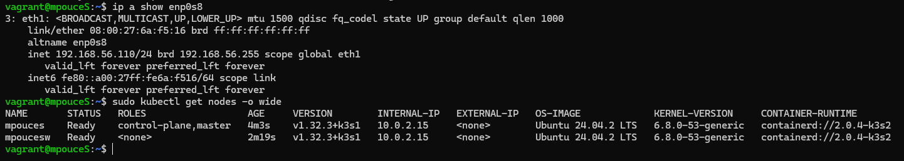
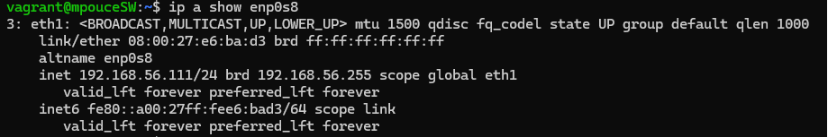

# Inception of Things

**Inception of Things** is a project designed as an introduction to **Kubernetes** using **K3d**, **K3s** and **Vagrant**.

This project is split in three distincts parts (p1, p2 and p3) as described below :

## Part 1: K3s and Vagrant

The goal of this part is to use Vagrant to set up 2 Virtual Machines.

We will write our first Vagrantfile using the latest stable version of the distribution of our choice, in this case Ubuntu.

Since Canonical did not release an official image of Ubuntu 24.04 for Vagrant, we will be using a custom image created by [Progress Chef](https://portal.cloud.hashicorp.com/vagrant/discover/bento/ubuntu-24.04).

From the subject, it is strongly advised to allow only the bare minimun to Virtual Machines in terms of resources, with a suggestion of 1 CPU core and 1024MB of RAM. <br>
In our case, we noticed that using such low ressources were causing errors with K3s, as the server communication with the client was too slow, so we bumped it up to 2 CPU cores and 2048MB of RAM.

### Requirements :
- The machines need to use the login of a team member for name, followed by a capital S for server, and SW for server worker.
- The Server machine IP needs to be 192.168.56.110 on the eth1 interface.
- The ServerWorker machine IP needs to be 192.168.56.111 on the eth1 interface.
- SSH connection should be available with no password on both machines.
- The Server machine will have K3s installed in controller mode.
- The ServerWorker machine will have K3s installed in agent mode.

You can see here a screenshot of the IP address on the Server machine, and K3s configuration<br>


You can see here the IP address of the Server Worker<br>


### Configuration :

The VMs are created from our [Vagrantfile](./p1/Vagrantfile), each configured with an IP address, host name, and provision script.<br>
We first start the Server machine to install K3s in controller mode, and retrieve the K3s token to connect with the ServerWorker.<br>
Once the Server is set up and ready, we start the ServerWorker and retrieve the token to connect to our server

### How to run it ?

Pretty simple. All you have to do, is go into the [p1 directory](./p1/) and run `vagrant up`.

After a few minutes, both VMs will be configured, and ready to use.<br>
If you want to check the configuration, you can use `vagrant ssh` to connect to each machine, as follow :

```bash
# Connect to the Server machine, use npouceSW for the ServerWorker.
vagrant ssh mpouceS

# Check the IP configuration.
# It is worth noting that with systemd v197, the inferface naming changed
# https://www.freedesktop.org/software/systemd/man/latest/systemd.net-naming-scheme.html
ip a show eth1

# Check the K3s configuration
sudo kubectl get nodes -o wide
```

## Part 2: K3s and three applications

In this part, we will set up one virtual machine with a load balancer, allowing us to access three different applications depending on the host used when making a request

### Requirements :
- The machine needs to use the login of a team member for name, followed by a capital S for server.
- The Server machine IP needs to be 192.168.56.110 on the eth1 interface.
### Configuration :
### How to run it ?
